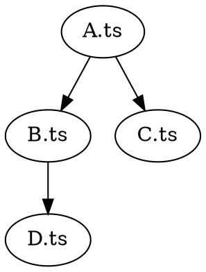
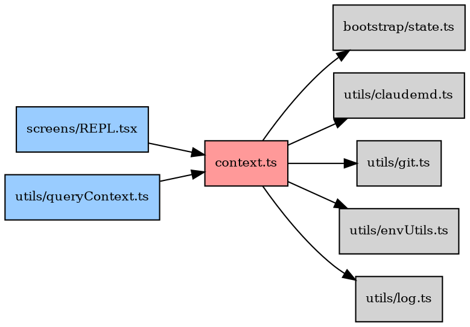

# 使用 Madge 生成 TypeScript/JavaScript 依赖图指南

## 什么是 Madge

Madge 是一个 Node.js 工具，通过静态分析 `import`/`require` 语句，解析模块间的依赖关系。它可以：

- 列出每个文件的直接依赖
- 检测循环依赖
- 找出孤立文件（没人引用的文件）
- 查看谁依赖了某个文件（反向依赖）
- 生成 DOT/SVG/PNG 可视化依赖图

底层原理：Madge 使用 `precinct` 库提取 import 语句，用 `dependency-tree` 构建依赖树，用 Graphviz 的 `dot` 命令渲染图形。

---

## 第一步：安装依赖

### 安装 Madge

```bash
npm install -g madge
```

### 安装 Graphviz（生成图片必需）

Graphviz 提供 `dot` 命令，负责将依赖关系渲染为 SVG/PNG 图片。

```bash
# RHEL / CentOS / Fedora
dnf install -y graphviz

# Debian / Ubuntu
apt-get install -y graphviz

# macOS
brew install graphviz

# Windows (Chocolatey)
choco install graphviz
```

验证安装：

```bash
madge --version
dot -V
```

---

## 第二步：基本用法

以下示例假设项目根目录有 `tsconfig.json`，源码在 `src/` 下。

### 2.1 列出依赖关系（文本）

```bash
# 从入口文件出发，列出所有可达模块的依赖
madge src/entrypoints/cli.tsx \
  --ts-config tsconfig.json \
  --extensions ts,tsx,js,jsx
```

输出格式：

```
context.ts
  bootstrap/state.ts
  utils/claudemd.ts
  utils/git.ts
```

表示 `context.ts` 依赖了 `bootstrap/state.ts`、`utils/claudemd.ts`、`utils/git.ts`。

**原理**：Madge 从指定入口递归解析 import 语句，`--ts-config` 让它理解 TypeScript 路径别名（如 `src/*`），`--extensions` 告诉它要扫描哪些后缀的文件。

### 2.2 检测循环依赖

```bash
madge src/ \
  --ts-config tsconfig.json \
  --extensions ts,tsx,js,jsx \
  --circular
```

输出示例：

```
1) utils/slowOperations.ts > utils/debug.ts
2) commands.ts > commands/add-dir/index.ts
```

表示 A 依赖 B，B 又依赖回 A（可能经过多层中转）。

**原理**：在依赖图中做深度优先搜索（DFS），检测是否存在回边（back edge），即访问到一个尚在当前递归栈中的节点。

### 2.3 查看反向依赖（谁依赖了某文件）

```bash
madge src/ \
  --ts-config tsconfig.json \
  --extensions ts,tsx,js,jsx \
  --depends context.ts
```

输出的是所有 import 了 `context.ts` 的文件列表。适合评估修改某个文件的影响范围。

### 2.4 查找孤立文件

```bash
madge src/ \
  --ts-config tsconfig.json \
  --extensions ts,tsx,js,jsx \
  --orphans
```

列出没有被任何其他文件 import 的文件。可能是废弃代码、入口文件、或测试文件。

---

## 第三步：生成可视化依赖图

### 3.1 直接生成 SVG

```bash
madge src/context.ts \
  --ts-config tsconfig.json \
  --extensions ts,tsx,js,jsx \
  --image deps.svg
```

**原理**：Madge 先构建依赖树，转为 DOT 格式的图描述语言，再调用 Graphviz 的 `dot` 命令渲染为 SVG。

> 注意：如果依赖树很大（上千个文件），渲染可能很慢甚至失败。建议对大项目只分析局部模块。

### 3.2 导出 DOT 格式（手动控制渲染）

```bash
# 导出 DOT 文件
madge src/context.ts \
  --ts-config tsconfig.json \
  --extensions ts,tsx,js,jsx \
  --dot > deps.dot

# 手动用 Graphviz 渲染（可以调整布局引擎）
dot -Tsvg deps.dot -o deps.svg      # 层级布局（默认）
neato -Tsvg deps.dot -o deps.svg    # 弹簧模型布局
fdp -Tsvg deps.dot -o deps.svg      # 力导向布局
circo -Tsvg deps.dot -o deps.svg    # 圆形布局

# 也可以输出 PNG
dot -Tpng deps.dot -o deps.png
```

**DOT 语言简介**：DOT 是 Graphviz 定义的图描述语言，例如：



表示 A 依赖 B 和 C，B 依赖 D。

### 3.3 导出 JSON（程序化处理）

```bash
madge src/context.ts \
  --ts-config tsconfig.json \
  --extensions ts,tsx,js,jsx \
  --json > deps.json
```

输出格式：

```json
{
  "context.ts": ["bootstrap/state.ts", "utils/git.ts"],
  "bootstrap/state.ts": ["utils/config.ts"]
}
```

可以用 Python/JS 脚本进一步分析、筛选、生成自定义图表。

---

## 第四步：手动构建精准依赖图（大项目推荐）

大项目直接 `--image` 渲染往往因节点太多而失败或不可读。更好的方式是：先用 madge 获取数据，再手写 DOT 只包含关心的模块。

### 步骤 1：获取目标文件的直接依赖

```bash
# 查看 context.ts 依赖了谁
madge src/ --ts-config tsconfig.json --extensions ts,tsx,js,jsx \
  | grep -A 20 "^context.ts"
```

### 步骤 2：获取反向依赖

```bash
# 查看谁依赖了 context.ts
madge src/ --ts-config tsconfig.json --extensions ts,tsx,js,jsx \
  --depends context.ts
```

### 步骤 3：手写 DOT 文件

根据上面两步的结果，创建一个只包含关键节点的 DOT 文件：



**DOT 语法速查**：

| 语法 | 含义 |
|---|---|
| `rankdir=LR` | 从左到右布局（默认 TB 从上到下） |
| `node [shape=box]` | 全局设置节点形状为方框 |
| `[fillcolor="#ff9999"]` | 设置节点填充颜色 |
| `"A" -> "B"` | A 依赖 B（有向边） |
| `subgraph cluster_X { ... }` | 分组子图（会画边框） |

### 步骤 4：渲染

```bash
dot -Tsvg context-focused.dot -o context-focused.svg
```

### 步骤 5：查看

```bash
# 浏览器打开
open context-focused.svg           # macOS
xdg-open context-focused.svg      # Linux
start context-focused.svg          # Windows

# 或转为 PNG
dot -Tpng context-focused.dot -o context-focused.png
```

---

## 第五步：分层依赖图生成（大项目必备）

大项目的完整依赖树动辄上千节点，`dot` 渲染时会 OOM 或超时。分层方式从入口文件出发，按 BFS（广度优先搜索）逐层展开依赖，每层单独生成一张图。

### 原理

```
Layer 0:  entry.ts                          ← 入口（1 个文件）
Layer 1:  entry.ts 的直接依赖               ← import 了谁（~10 个）
Layer 2:  Layer 1 每个文件的直接依赖         ← 二级展开（~40 个）
Layer 3:  Layer 2 每个文件的直接依赖         ← 三级展开（~100 个）
...
```

每层独立渲染，节点数可控（通常每层几十个），不会因为图太大而崩溃。同时生成一张概览图，用 subgraph 按层着色分组。

### 步骤 1：导出 madge JSON

```bash
cd your-project/
madge src/ --ts-config tsconfig.json --extensions ts,tsx,js,jsx \
  --json 2>/dev/null > deps.json
```

这会生成完整的依赖关系 JSON，格式为 `{ "文件A": ["依赖1", "依赖2"], ... }`。

### 步骤 2：运行分层脚本

```bash
# 基本用法：从 context.ts 出发，展开 3 层
python3 layered-deps.py deps.json context.ts 3

# 从项目入口出发，展开 5 层
python3 layered-deps.py deps.json cli.tsx 5

# 分析任意模块
python3 layered-deps.py deps.json utils/auth.ts 2
```

脚本会自动：
1. 从入口文件做 BFS 分层
2. 为每层生成 DOT 文件和 SVG 图片
3. 生成全局概览图（所有层合并，按层着色）
4. 生成 README.md 汇总（层级表格 + 文件清单）

### 步骤 3：查看输出

```bash
# 输出目录结构
layers-context/
├── README.md         # 汇总文档
├── overview.svg      # 全局概览（所有层，按颜色分组）
├── overview.dot
├── layer-0.svg       # 入口层
├── layer-0.dot
├── layer-1.svg       # 直接依赖层
├── layer-1.dot
├── layer-2.svg       # 二级依赖层
├── layer-2.dot
└── ...
```

### 颜色含义

| 颜色 | 层级 |
|---|---|
| 红色 `#ff9999` | Layer 0（入口） |
| 橙色 `#ffcc99` | Layer 1（直接依赖） |
| 黄色 `#ffff99` | Layer 2（二级依赖） |
| 绿色 `#99ff99` | Layer 3（三级依赖） |
| 蓝色 `#99ccff` | Layer 4 |
| 紫色 `#cc99ff` | Layer 5 |

### 实际案例

以 free-code45 的 `context.ts` 为例：

```bash
# 导出
madge src/context.ts --ts-config tsconfig.json \
  --extensions ts,tsx,js,jsx --json 2>/dev/null > deps.json

# 分 3 层
python3 layered-deps.py deps.json context.ts 3
```

结果：

```
Layer 0:   1 个文件   context.ts
Layer 1:   9 个文件   git.ts, claudemd.ts, envUtils.ts, ...
Layer 2:  41 个文件   config.ts, settings.ts, model.ts, ...
Layer 3: 105 个文件   Tool.ts, messages.ts, auth.ts, ...
总计:    156 个文件
```

每层都能成功渲染 SVG，而直接对 1788 个节点跑 `dot` 则会 OOM。

### 脚本依赖

```bash
pip install markdown    # 可选，仅 md2html 转换需要
npm install -g madge    # madge 工具
dnf install graphviz    # dot 渲染引擎（或 apt/brew）
```

脚本本身只依赖 Python 3 标准库，无需额外安装。

---

## 常见问题

### Q: madge 只解析了很少的文件

Bun/Deno 项目中 import 路径常带 `.js` 后缀（如 `import x from './foo.js'`），但实际文件是 `.ts`。需要加 `--extensions ts,tsx,js,jsx` 让 madge 正确解析。

### Q: 渲染超时或失败（OOM / SIGKILL）

依赖图节点太多时 Graphviz 的 `dot` 会内存爆炸。解决方案（按推荐顺序）：

1. **分层生成**（推荐）：用 `layered-deps.py` 按 BFS 逐层渲染，详见第五步
2. **手写 DOT**：只画关心的关键节点，详见第四步
3. **缩小范围**：只分析单个入口文件而非整个 `src/`
4. **导出 JSON**：用 `--json` 导出后用脚本筛选再渲染

### Q: 循环依赖数量巨大

Madge 列出的是所有可能的循环路径（排列组合），不是独立的环。实际需要修复的核心环路通常只有几个。关注最短的循环路径，它们是问题根源。

### Q: 路径别名不识别

确保 `tsconfig.json` 中配置了 `paths`，并通过 `--ts-config` 传给 madge：

```json
{
  "compilerOptions": {
    "baseUrl": ".",
    "paths": {
      "src/*": ["src/*"],
      "@utils/*": ["src/utils/*"]
    }
  }
}
```

---

## 快速参考

```bash
# 依赖列表
madge src/ --ts-config tsconfig.json --extensions ts,tsx

# 循环依赖
madge src/ --ts-config tsconfig.json --extensions ts,tsx --circular

# 反向依赖
madge src/ --ts-config tsconfig.json --extensions ts,tsx --depends foo.ts

# 孤立文件
madge src/ --ts-config tsconfig.json --extensions ts,tsx --orphans

# 生成图片
madge src/entry.ts --ts-config tsconfig.json --extensions ts,tsx --image graph.svg

# 导出 DOT
madge src/entry.ts --ts-config tsconfig.json --extensions ts,tsx --dot > graph.dot

# 导出 JSON
madge src/entry.ts --ts-config tsconfig.json --extensions ts,tsx --json > graph.json

# 手动渲染 DOT
dot -Tsvg graph.dot -o graph.svg
dot -Tpng graph.dot -o graph.png

# 分层生成（大项目推荐，避免 OOM）
madge src/ --ts-config tsconfig.json --extensions ts,tsx --json 2>/dev/null > deps.json
python3 layered-deps.py deps.json entry.ts 3
```
